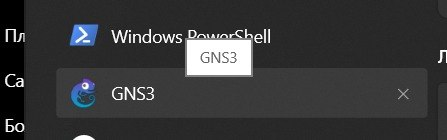
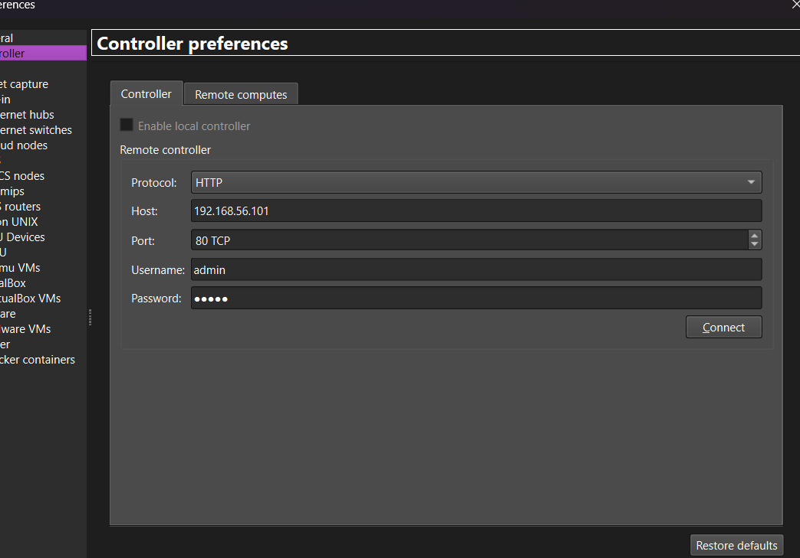
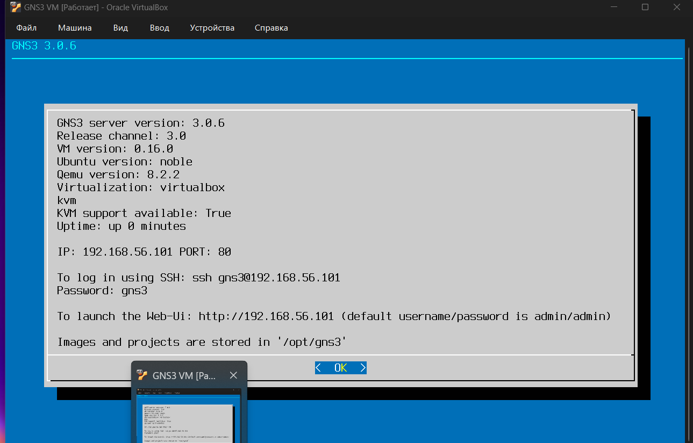
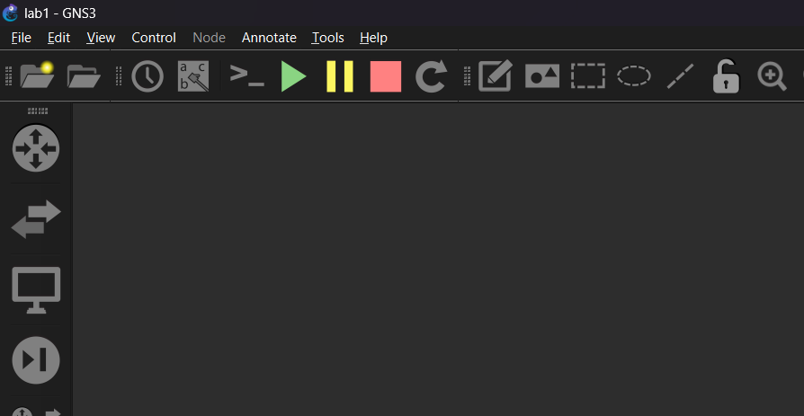
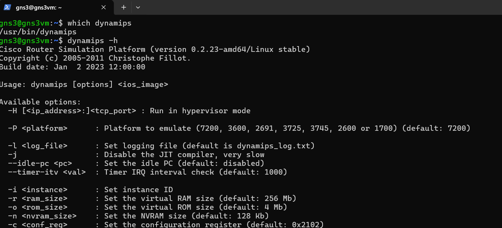
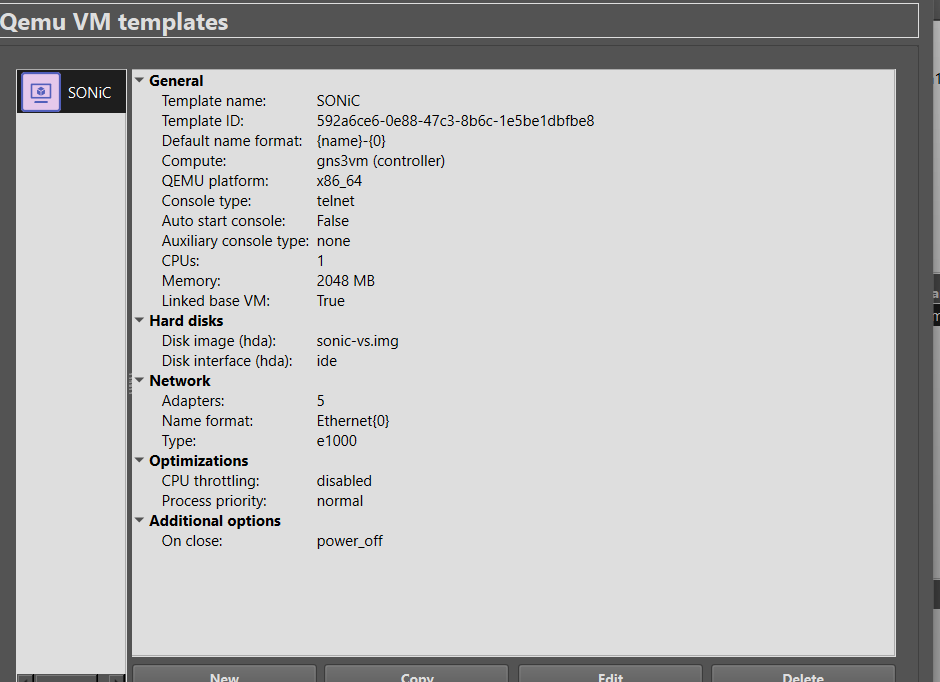
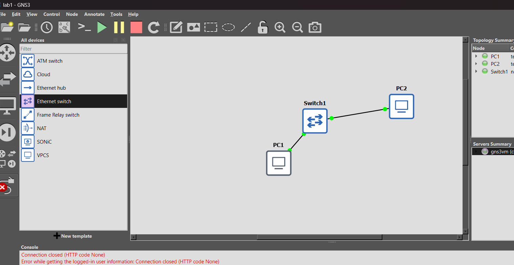
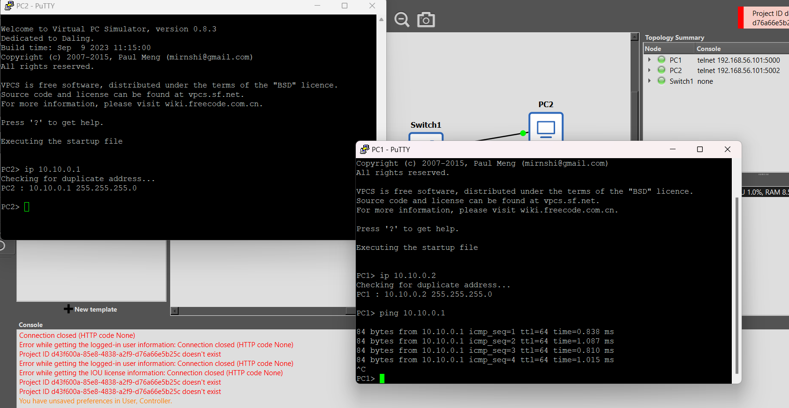

# Лабораторная работа № 1

## Установка GNS3 и базовая настройка

**Курс:** «Виртуализация сетевых функций», 2026/2027  
**Университет:** ИТМО, факультет ФИКТ  
**Группа:** K3420  
**Выполнил:** Панин Дмитрий Владимирович

## Цель работы

Подготовить среду GNS3 для моделирования сетей, проверить основные компоненты виртуальной машины и собрать небольшую топологию, чтобы убедиться в обмене данными между виртуальными компьютерами.

## Подготовка среды GNS3

Графическое приложение GNS3 было запущено в Windows. Для выполнения вычислений использовалась GNS3 VM в VirtualBox.

В настройках клиента указан удаленный контроллер по адресу `192.168.56.101`, протокол HTTP, порт `80`.

Консоль виртуальной машины показывает, что сервер GNS3 версии `3.0.6` работает в VM `0.16.0` на Ubuntu Noble. Также отображаются QEMU `8.2.2`, VirtualBox и доступность KVM-ускорения.

Для проверки интерфейса был создан проект `lab1`.

## Проверка компонентов и шаблона SONiC

Наличие Dynamips проверено из командной строки виртуальной машины: исполняемый файл найден в `/usr/bin/dynamips`, а справка указывает версию `0.2.23-amd64/Linux stable`.

В списке шаблонов QEMU настроен SONiC. На снимке видны один виртуальный процессор, 2048 МБ памяти, образ диска `sonic-vs.img` и пять сетевых адаптеров типа `e1000`.

## Тестовая топология

В тестовом проекте размещены два узла VPCS (`PC1` и `PC2`), соединенные через Ethernet-коммутатор `Switch1`.

Узлам назначены адреса из одной подсети:

| Узел | IPv4-адрес | Маска |
| --- | --- | --- |
| PC1 | `10.10.0.2` | `255.255.255.0` |
| PC2 | `10.10.0.1` | `255.255.255.0` |

С консоли PC1 выполнена проверка доступности PC2 командой `ping 10.10.0.1`. На снимке видны четыре ответа ICMP от узла `10.10.0.1`, поэтому обмен пакетами между VPCS подтвержден.

## Результат

GNS3 VM запущена, Dynamips доступен, а шаблон SONiC присутствует в перечне QEMU-шаблонов. В тестовой сети PC1 получил ответы от PC2; после проверки проект сохранен командой `save`.

На снимке окна GNS3 с топологией одновременно показаны сообщения о закрытом соединении с контроллером и отсутствующем идентификаторе проекта. Поэтому приложенные материалы подтверждают передачу ICMP между VPCS, но не позволяют утверждать, что управление проектом через контроллер в тот момент работало без ошибок.
