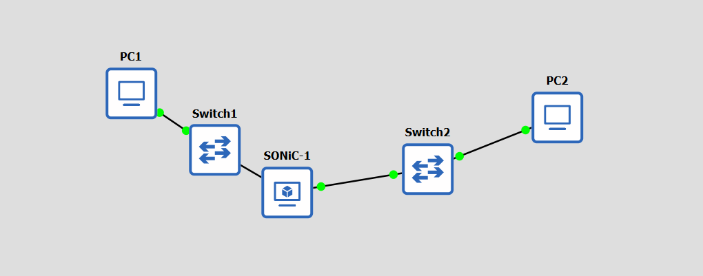
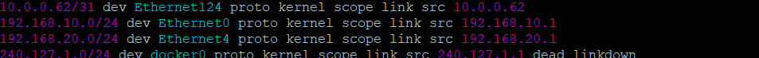
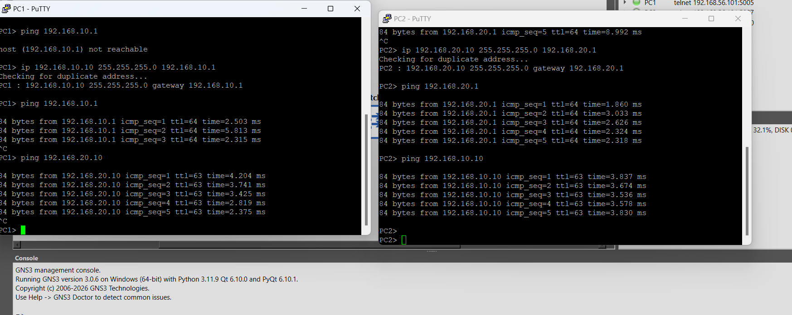

# Лабораторная работа № 2

## Настройка маршрутизатора SONiC в GNS3 и построение простой сети

- **Дисциплина:** Виртуализация сетевых функций
- **Университет:** ИТМО, факультет ФИКТ
- **Группа:** K3420
- **Выполнил:** Панин Дмитрий Владимирович

## Цель работы

Настроить маршрутизатор SONiC в GNS3, подключить к нему два сегмента сети и проверить связь между узлами, расположенными в разных подсетях.

## Схема и адресация сети

В GNS3 собрана цепочка **PC1 — Switch1 — SONiC-1 — Switch2 — PC2**. Коммутаторы соединяют виртуальные компьютеры с отдельными интерфейсами маршрутизатора. На схеме все соединения отображаются активными.



*Рисунок 1 — Топология сети в GNS3.*

Устройства распределены по двум подсетям. Интерфейс `Ethernet0` маршрутизатора обслуживает сегмент PC1, а `Ethernet4` — сегмент PC2.

| Устройство или интерфейс | IPv4-адрес | Шлюз по умолчанию |
| --- | --- | --- |
| PC1 | `192.168.10.10/24` | `192.168.10.1` |
| SONiC `Ethernet0` | `192.168.10.1/24` | — |
| PC2 | `192.168.20.10/24` | `192.168.20.1` |
| SONiC `Ethernet4` | `192.168.20.1/24` | — |

## Настройка маршрутизатора SONiC

Адреса интерфейсов SONiC назначены командами:

```bash
sudo config interface ip add Ethernet0 192.168.10.1/24
sudo config interface ip add Ethernet4 192.168.20.1/24
```

Команда `ip route` использовалась для просмотра таблицы маршрутизации. В ее выводе видны напрямую подключенные сети `192.168.10.0/24` на `Ethernet0` и `192.168.20.0/24` на `Ethernet4`.



*Рисунок 2 — Записи о подключенных подсетях в таблице маршрутизации SONiC.*

## Настройка узлов и проверка связи

На PC1 и PC2 настроены адреса и шлюзы соответствующих сегментов:

```text
PC1> ip 192.168.10.10 255.255.255.0 192.168.10.1
PC2> ip 192.168.20.10 255.255.255.0 192.168.20.1
```

После настройки выполнены проверки доступности шлюзов и узлов. Сначала PC1 не смог связаться со шлюзом: эта попытка на снимке предшествует назначению ему адреса. После настройки адреса PC1 получил ответы от `192.168.10.1`. PC2 также получил ответы от своего шлюза `192.168.20.1`.

Для проверки маршрутизации между подсетями PC1 отправлял запросы на `192.168.20.10`, а PC2 — на `192.168.10.10`. На снимке видны пять ответов в каждом направлении с TTL 63, что подтверждает прохождение пакетов через маршрутизатор SONiC.



*Рисунок 3 — Конфигурация VPCS и результаты ping между узлами.*

После настройки конфигурация VPCS сохранена командой `save`, а конфигурация SONiC — командой `sudo config save -y`.

## Результат

В GNS3 создана сеть из двух подсетей, подключенных к разным интерфейсам SONiC. Таблица маршрутизации показывает наличие обеих непосредственно подключенных сетей. После назначения адресов PC1 и PC2 получили ответы от своих шлюзов, а узлы обменялись ICMP-пакетами через маршрутизатор.
