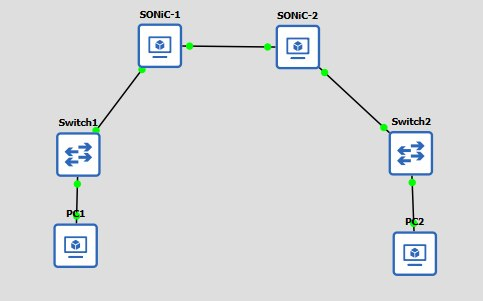
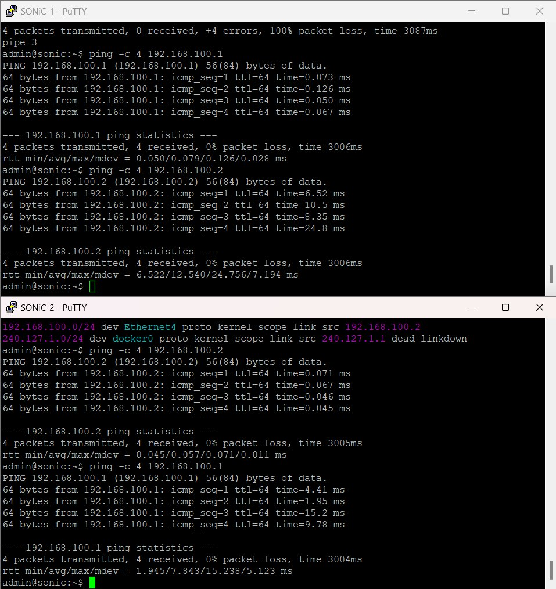
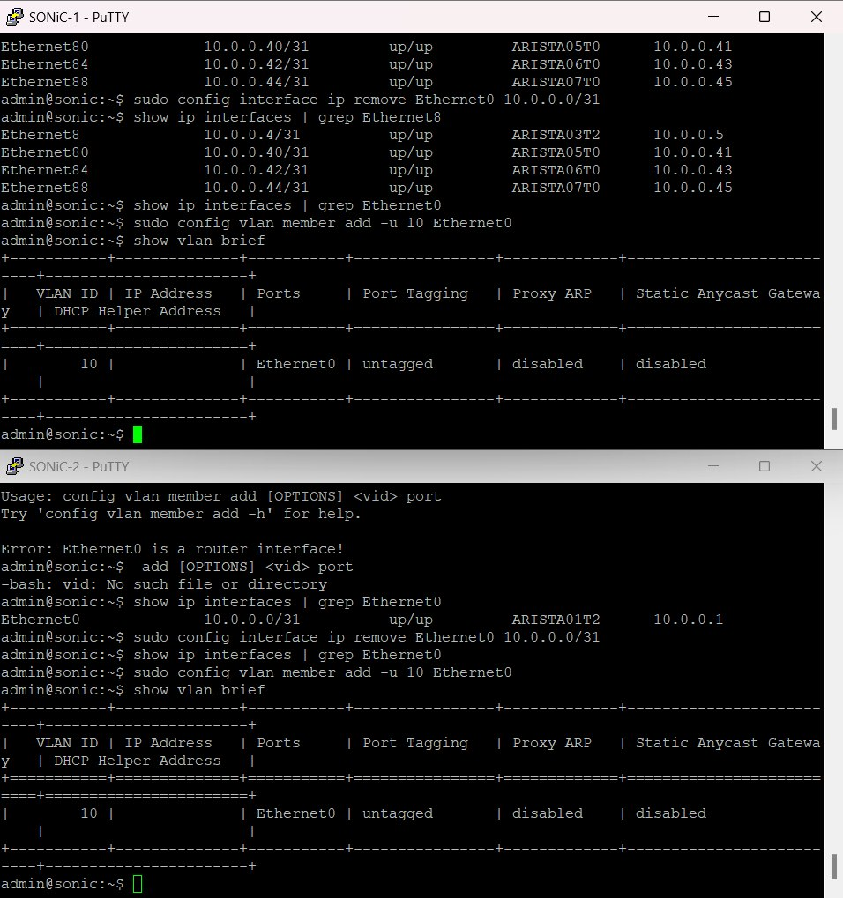
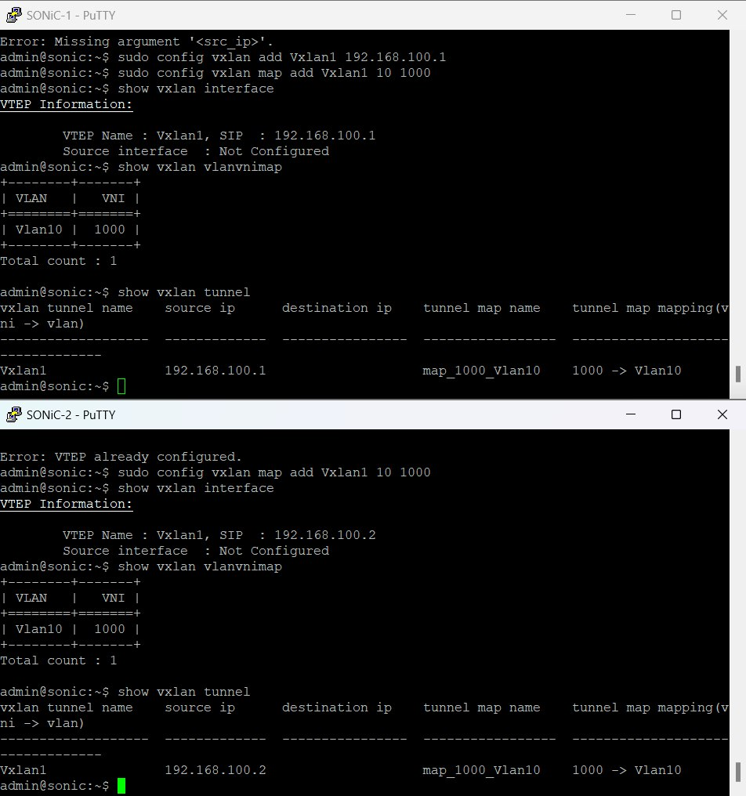
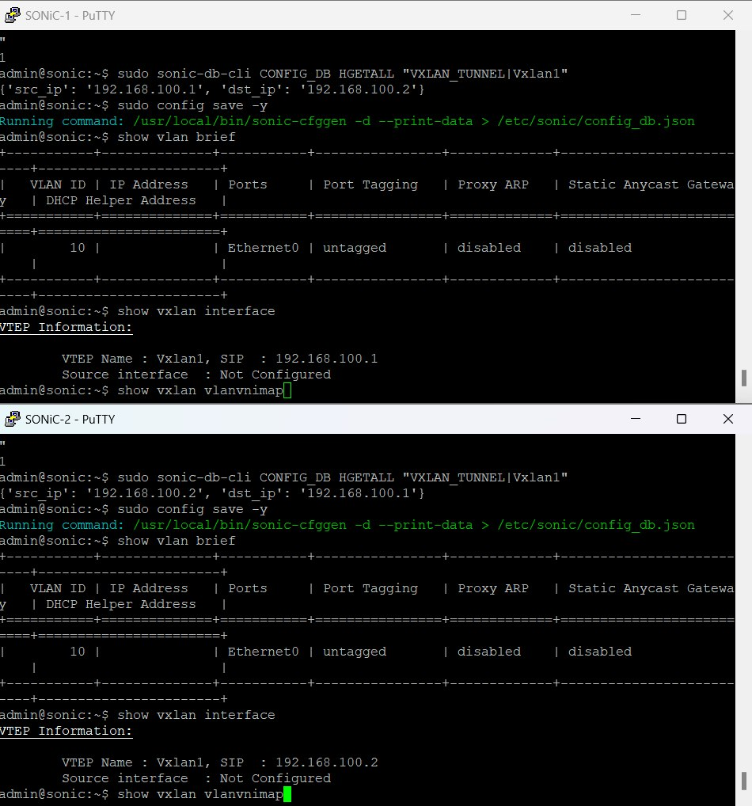
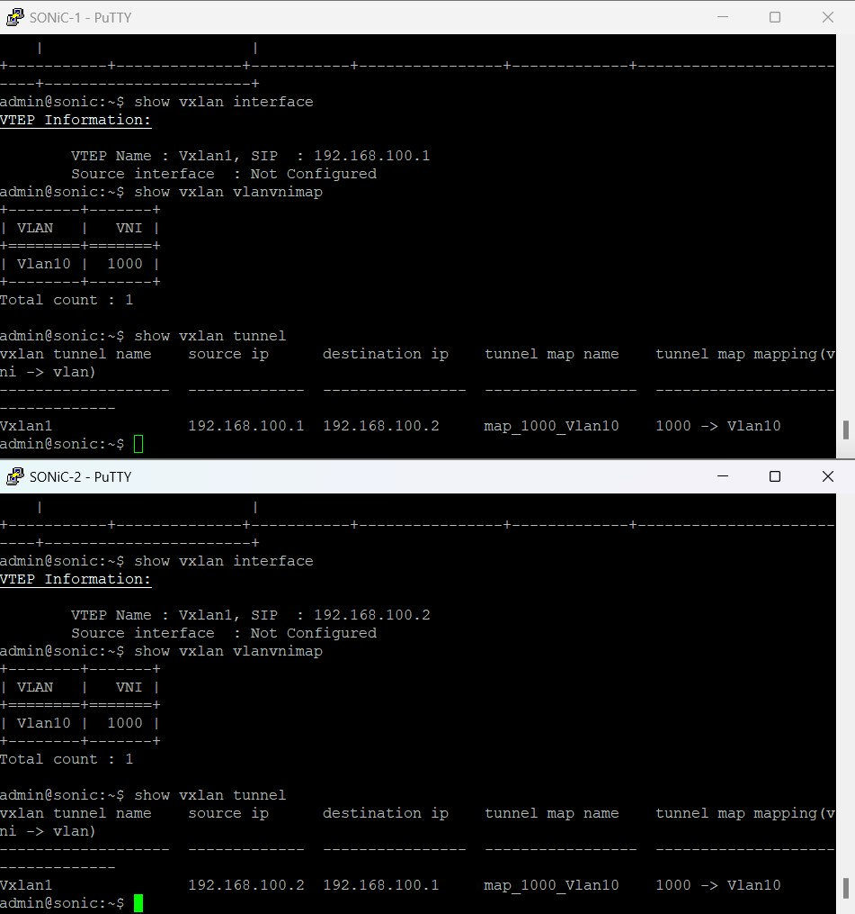
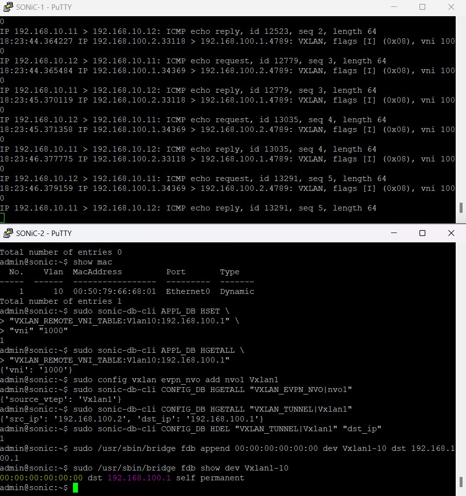
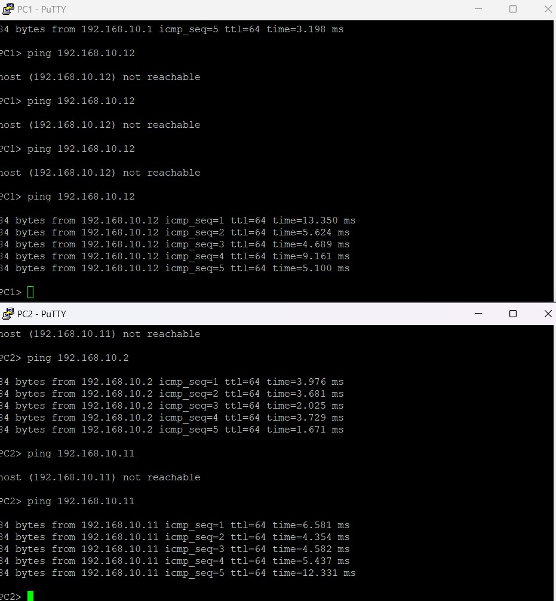

# Лабораторная работа № 3

## Настройка VXLAN в GNS3 на базе двух маршрутизаторов SONiC

- **Дисциплина:** Виртуализация сетевых функций
- **Университет:** ИТМО, факультет ФИКТ
- **Группа:** K3420
- **Выполнил:** Панин Дмитрий Владимирович
- **Руководитель:** Аминов Н.С.

## Цель работы

Построить в GNS3 сеть из двух виртуальных маршрутизаторов SONiC и объединить их локальные сегменты с помощью VXLAN. Проверить связность underlay, настроить VLAN 10 и VNI 1000, а затем подтвердить передачу трафика между PC1 и PC2.

## Топология и адресация сети

В GNS3 собрана топология из двух маршрутизаторов SONiC, двух коммутаторов и двух виртуальных компьютеров. PC1 и PC2 подключены к портам Ethernet0 своих маршрутизаторов через Switch1 и Switch2. Маршрутизаторы связаны напрямую через Ethernet4.



*Рисунок 1 — Топология лабораторной сети в GNS3.*

Для underlay выбрана сеть `192.168.100.0/24`. В overlay компьютеры размещены в одной сети `192.168.10.0/24`. VLAN 10 на обоих маршрутизаторах сопоставлена с VNI 1000.

| Устройство или интерфейс | Адрес или назначение |
| --- | --- |
| R1 Ethernet4 | `192.168.100.1/24`, underlay |
| R2 Ethernet4 | `192.168.100.2/24`, underlay |
| R1 Ethernet0 | Порт доступа VLAN 10, без IP-адреса |
| R2 Ethernet0 | Порт доступа VLAN 10, без IP-адреса |
| PC1 | `192.168.10.11/24` |
| PC2 | `192.168.10.12/24` |
| VLAN 10 | VNI 1000 |

## Настройка интерфейсов и underlay

На образе SONiC интерфейс Ethernet0 изначально имел IP-адрес и воспринимался как маршрутизируемый порт. Поэтому первая попытка добавить его в VLAN завершилась сообщением `Ethernet0 is a router interface`. Адрес `10.0.0.0/31` удалили с Ethernet0, после чего порт удалось включить в VLAN 10 как нетегированный.

На Ethernet4 настроены адреса `192.168.100.1/24` на R1 и `192.168.100.2/24` на R2. В таблице маршрутизации появилась непосредственно подключённая сеть `192.168.100.0/24` через Ethernet4. Проверка `ping` прошла в обоих направлениях.



*Рисунок 2 — Успешная проверка underlay с R1 и R2.*

## Создание VLAN 10

На обоих маршрутизаторах создана VLAN 10. Интерфейс Ethernet0 добавлен в неё как untagged-порт:

```bash
sudo config vlan add 10
sudo config vlan member add -u 10 Ethernet0
show vlan brief
```

После удаления адреса с Ethernet0 команда добавления в VLAN завершилась успешно. Вывод `show vlan brief` показывает Ethernet0 как untagged-порт VLAN 10 на R1 и R2.



*Рисунок 3 — Удаление адреса с Ethernet0 и добавление порта в VLAN 10.*

## Настройка VXLAN

На R1 настроен VTEP с адресом источника `192.168.100.1`, а на R2 — VTEP с адресом источника `192.168.100.2`. VLAN 10 сопоставлена с VNI 1000:

```bash
# R1
sudo config vxlan add Vxlan1 192.168.100.1

# R2
sudo config vxlan add Vxlan1 192.168.100.2

# На обоих маршрутизаторах
sudo config vxlan map add Vxlan1 10 1000
sudo config vxlan evpn_nvo add nvo1 Vxlan1
```

При проверке VTEP на R2 CLI сообщил, что он уже настроен; дальнейшую настройку сопоставления VLAN и VNI выполнили для существующего Vxlan1. В конфигурационной записи `VXLAN_TUNNEL|Vxlan1` проверены адреса источника и назначения: R1 использует пару `192.168.100.1` → `192.168.100.2`, R2 — `192.168.100.2` → `192.168.100.1`. После настройки конфигурация SONiC сохранена командой `sudo config save -y`.



*Рисунок 4 — Настройка VTEP и сопоставление VLAN 10 с VNI 1000.*

Для передачи широковещательных кадров и ARP между VTEP добавлены записи удалённого VNI и flood FDB. На R1 указан удалённый VTEP `192.168.100.2`, на R2 — `192.168.100.1`. Записи `VXLAN_TUNNEL|Vxlan1` проверены в CONFIG_DB.



*Рисунок 5 — Адреса источника и назначения в VXLAN_TUNNEL и сохранение конфигурации.*

Команды проверки показывают VLAN 10, сопоставленную с VNI 1000, и туннель с соответствующими адресами VTEP:

```bash
show vxlan interface
show vxlan vlanvnimap
show vxlan tunnel
```

В выводе `show vxlan interface` поле `Source interface` отображается как `Not Configured`. При этом `show vxlan tunnel` показывает адреса источника и назначения и сопоставление `1000 -> Vlan10`; фактическая передача VXLAN-пакетов дополнительно проверена захватом трафика.



*Рисунок 6 — Проверка VTEP, VLAN-to-VNI mapping и адресов VXLAN-туннеля.*

## Проверка связи между PC1 и PC2

На PC1 установлен адрес `192.168.10.11/24`, на PC2 — `192.168.10.12/24`. Шлюз не задавался: оба компьютера находятся в одной overlay-подсети.

Для подтверждения инкапсуляции на Ethernet4 запущен `tcpdump` с фильтром UDP-порта 4789. В захвате видны внутренние ICMP-пакеты между `192.168.10.11` и `192.168.10.12`, заключённые в VXLAN-пакеты между underlay-адресами `192.168.100.1` и `192.168.100.2`. В заголовке VXLAN указан VNI 1000.



*Рисунок 7 — Инкапсуляция ICMP-трафика в VXLAN с VNI 1000.*

После настройки flood-записей ping между PC1 и PC2 прошёл в обоих направлениях. На ранних попытках VPCS выводил `host not reachable`; при повторной проверке появились ответы от второго компьютера.



*Рисунок 8 — Успешный обмен ICMP-пакетами между PC1 и PC2.*

## Результат

В GNS3 построена сеть с двумя маршрутизаторами SONiC и настроен underlay между ними. Порты Ethernet0 включены в VLAN 10, которая сопоставлена с VNI 1000. В CONFIG_DB и APPL_DB заданы адреса удалённых VTEP и параметры передачи удалённого VNI, а для широковещательного трафика добавлены flood FDB-записи. Захват на Ethernet4 подтвердил передачу VXLAN-трафика по UDP-порту 4789 с VNI 1000. PC1 и PC2 обменялись ICMP-пакетами в обоих направлениях.
